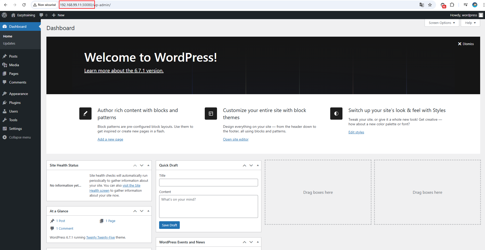

# WordPress Application Deployment on Kubernetes

This project demonstrates the deployment of a WordPress application on a Kubernetes cluster. It consists of a MySQL database (backend) and a WordPress instance (frontend). The deployment leverages Kubernetes' declarative configuration using a `kustomization.yml` file to manage resources effectively.

## Project Structure

The project includes the following Kubernetes resources defined in the `kustomization.yml` file:

### Resources in `kustomization.yml`:
- **Namespace:** `wp-namespace.yml`
- **Secrets:** `wordpress-secrets.yml`
- **Persistent Volumes (PV) and Claims (PVC):**
  - `wordpress-pv.yml`
  - `wordpress-pvc.yml`
- **MySQL Deployment and Service:**
  - `mysql-deployment.yml`
  - `mysql-clusterIP-svc.yml`
- **WordPress Deployment and Service:**
  - `wordpress-deployment.yml`
  - `wordpress-nodeport-svc.yml`

## Namespace
All resources are deployed in the `wordpress-app` namespace to isolate them from other applications in the cluster.

## Secrets
- **`wordpress-secrets.yml`:** Contains sensitive data, such as:
  - `MYSQL_PASSWORD`
  - `MYSQL_ROOT_PASSWORD`
  - `WORDPRESS_DB_PASSWORD`

## Persistent Storage
- **MySQL:** PersistentVolumeClaim defined in `wordpress-pvc.yml` ensures data durability for the database.
- **WordPress:** A separate PVC provides persistent storage for WordPress application data.

## Deployments and Services
1. **MySQL:**
   - Deployment uses the `mysql:5.7` image.
   - Configured with environment variables for database initialization.
   - A ClusterIP Service (`mysql-clusterIP-svc.yml`) exposes the database internally.

2. **WordPress:**
   - Deployment uses the `wordpress:6.7.1` image.
   - Configured to connect to the MySQL database using environment variables and secrets.
   - A NodePort Service (`wordpress-nodeport-svc.yml`) exposes WordPress externally.

---

## Prerequisites

Before deploying, ensure:
1. A Kubernetes cluster is running.
2. Kubernetes CLI (`kubectl`) is installed and configured.
3. Persistent storage is available for the PVCs.
4. Secrets are properly configured in `wordpress-secrets.yml`.

---

## Deployment Steps

1. **Apply the Kustomization:**
   Use the `kustomization.yml` file to deploy all resources:
   ```bash
   cd k8s_manifests
   kubectl apply -k .
   ```

2. **Verify Resources:**
Check the status of all deployed resources:

```bash
kubectl -n wordpress-app get all
```


3. **Access WordPress :**
   Use the Ip address and NodePort to access the WordPress application:




## Conclusion

This mini-project demonstrates the deployment of a WordPress application backed by a MySQL database on a Kubernetes cluster. Using a modular and declarative approach, key resources such as namespaces, secrets, persistent volumes, and deployments are configured to ensure scalability, security, and reliability. This project serves as a practical foundation for deploying similar containerized applications on Kubernetes.

Thank you for exploring this litle project, feel free to reach out with any feedback or questions to further enhance its implementation and functionality!

